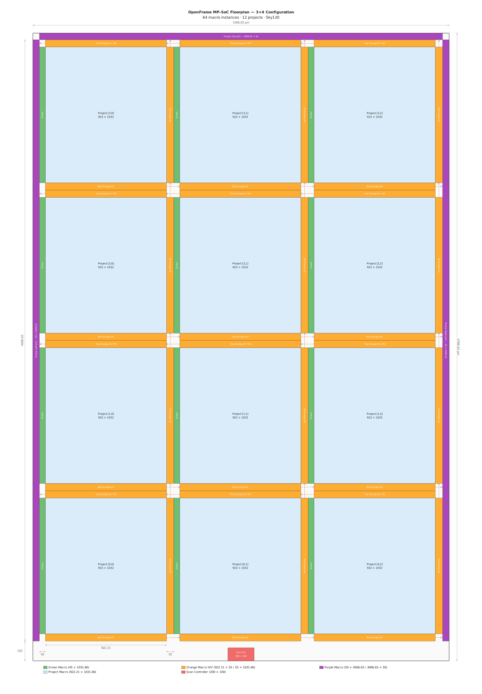
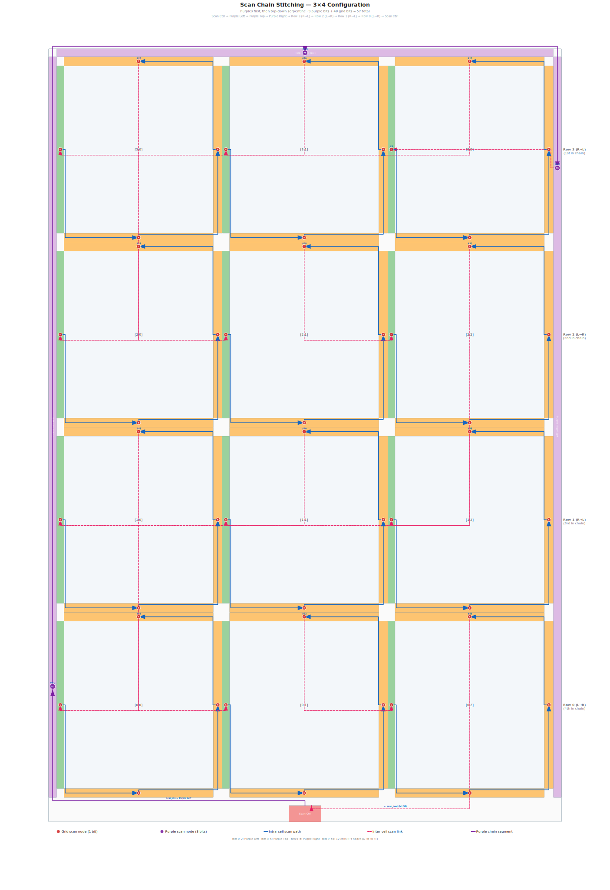

# Q-PULSE — TinyECG Arrhythmia Classifier on Silicon

Q-PULSE is a full-stack **ECG arrhythmia classifier** that travels from a trained neural network all the way to a physical chip. A lightweight **1D CNN (TinyECG)** classifies 187-sample ECG windows into 5 arrhythmia classes, is compiled to fixed-point RTL using **hls4ml / Vitis HLS**, wrapped with a UART interface, verified with **cocotb + pyUVM** and a simulator-free **UART Hardware-in-the-Loop (HIL)** path, hardened in **LibreLane** for the **Sky130** process, and taped out as one project slot in an **eFabless OpenFrame Multi-Project Chip** (Silicon Sprint 26).

> **HIL is based on a patched version of PyUVM.**
> The same tests and sequences can be reused across simulator and hardware runs.

---

## Table of Contents

- [Q-PULSE — TinyECG Arrhythmia Classifier on Silicon](#q-pulse--tinyecg-arrhythmia-classifier-on-silicon)
  - [Table of Contents](#table-of-contents)
  - [Project Overview](#project-overview)
  - [Repository Structure](#repository-structure)
  - [Component Deep-Dives](#component-deep-dives)
    - [1. ML Model Training](#1-ml-model-training)
      - [TinyECG Architecture](#tinyecg-architecture)
    - [2. HLS Conversion (hls4ml + Vitis HLS)](#2-hls-conversion-hls4ml--vitis-hls)
      - [Quantisation \& Precision](#quantisation--precision)
      - [HLS Configuration Summary](#hls-configuration-summary)
      - [Makefile Flow](#makefile-flow)
      - [FIFO Depth Tuning](#fifo-depth-tuning)
    - [3. HLS Synthesis Results](#3-hls-synthesis-results)
      - [Performance](#performance)
      - [AXI-Stream Interfaces](#axi-stream-interfaces)
    - [4. RTL Sources](#4-rtl-sources)
      - [HLS-Generated Modules (`tiny_ecg_no_activ_*`)](#hls-generated-modules-tiny_ecg_no_activ_)
      - [Integration RTL](#integration-rtl)
    - [5. Verification](#5-verification)
      - [DUT](#dut)
      - [Architecture](#architecture)
      - [UART Packet Protocol](#uart-packet-protocol)
    - [Hardware-in-the-Loop (FPGA/UART, asyncio pyUVM)](#hardware-in-the-loop-fpgauart-asyncio-pyuvm)
    - [6. Place \& Route — LibreLane](#6-place--route--librelane)
      - [Design Parameters](#design-parameters)
      - [Config Stage Pipeline](#config-stage-pipeline)
      - [PnR Results — `pnr_explore_eco` run](#pnr-results--pnr_explore_eco-run)
      - [Timing Summary (post-PnR STA)](#timing-summary-post-pnr-sta)
    - [7. OpenFrame Multi-Project Wrapper](#7-openframe-multi-project-wrapper)
      - [Grid Architecture](#grid-architecture)
  - [Tools \& Dependencies](#tools--dependencies)
  - [Quickstart](#quickstart)
    - [1. Train the Model](#1-train-the-model)
    - [2. Convert Keras → HLS](#2-convert-keras--hls)
    - [3. Compare Accuracy](#3-compare-accuracy)
    - [4. Run RTL Verification (Simulator)](#4-run-rtl-verification-simulator)
    - [5. Run FPGA HIL](#5-run-fpga-hil)
    - [6. Physical Implementation](#6-physical-implementation)
  - [Key Parameters](#key-parameters)
  - [Dataset](#dataset)

---

## Project Overview

```
MIT-BIH CSV ──► Keras Training ──► .h5 model
                                        │
                                   hls4ml convert
                                        │
                               Vitis HLS synthesis
                                        │
                              Verilog RTL + weights
                                        │
                    ┌───────────────────┴────────────────────┐
                    │          ecg_wrapper (top)             │
                    │  UART-RX ──► TinyECG core ──► UART-TX  │
                    └───────────────────┬────────────────────┘
                               cocotb / pyUVM
                               verification
                                        │
                              LibreLane PnR (Sky130)
                                        │
                          project_macro (880 × 1032 µm)
                                        │
                        eFabless OpenFrame MP-SoC slot
```

---

## Repository Structure

```
si-sprint26-project-q-pulse/
├── src/                          # Final RTL sources for tape-out
│   ├── verilog/                  # Synthesised Verilog + integration RTL
│   │   ├── tiny_ecg_no_activ*.v  # HLS-generated inference engine
│   │   ├── ecg_wrapper.v         # Top-level: ECG core + UART bridge
│   │   ├── axis_uart_tx_bridge.v # AXI-Stream → UART TX
│   │   ├── uart_rx.v             # UART receiver
│   │   ├── uart_rx_axis_bridge.v # UART RX → AXI-Stream CSR packets
│   │   ├── uart_tx.v             # UART transmitter
│   │   ├── FixedCompare.v        # Fixed-point comparison utility
│   │   └── *.dat                 # ROM initialisation files (weights)
│   └── report/
│       └── csynth.rpt            # Vitis HLS synthesis report
│
├── verf/                         # Hardware verification
│   ├── ecg_uvm/                  # pyUVM (cocotb) verification environment
│   │   ├── cfg.py                # Environment configuration dataclass
│   │   ├── protocol.py           # UART packet protocol model
│   │   ├── data_loader.py        # Test-vector loader
│   │   ├── runtime.py            # Simulation runtime helpers
│   │   ├── uart_rx_uvc/          # Active UART-RX agent
│   │   ├── uart_tx_uvc/          # Passive UART-TX monitor
│   │   ├── env/                  # Scoreboard + environment
│   │   ├── tests/                # Test classes (Smoke, MiniRegression)
│   │   └── tv/                   # Reference test vectors
│   ├── pyuvm_ecg/                # Alternate pyUVM test suite
│   ├── uart_tx_uvc/              # UVC for UART TX (SystemVerilog)
│   └── Makefile                  # cocotb sim entry point
│
├── pnr/                          # Physical implementation
│   ├── project_macro/            # LibreLane config for the ECG macro
│   │   ├── config.json           # Locked LibreLane config (merged)
│   │   ├── config_stages/        # Staged JSON configs (syn→signoff+eco)
│   │   ├── pin_order.cfg         # I/O pin assignment
│   │   ├── pnr.sdc / signoff.sdc # Timing constraints
│   │   ├── merge_configs.py      # Config stage merger
│   │   ├── fixed_dont_change/    # Pre-placed DEF templates
│   │   ├── drc_report.rpt        # DRC results
│   │   └── runs/                 # LibreLane run outputs
│   ├── Makefile                  # LibreLane / Caravel flow entry point
│   ├── Caravel_OF_MPC.md         # Full OpenFrame architecture spec
│   └── README.md                 # Multi-project chip documentation
│
├── hls4ml/                       # HLS conversion — tape-out run
│   ├── Makefile
│   └── tiny_ecg_clip_reluf3s_run1/   ← tape-out HLS project
│       └── hls4ml_config.yml
├── fpga/                         # FPGA bitstream + hardware test flow
│   ├── testing/                  # HIL runners, UVM envs, UART debug notes
│   │   ├── run_hil.py            # asyncio entry point (no cocotb simulator)
│   │   ├── README.md             # Detailed pyuvm asyncio backend notes
│   │   └── Makefile              # Includes `hil` / `hil-test` targets
│   └── Makefile                  # FPGA build and test helpers
├── model/                        # Exported model files (JSON + H5)
└── scripts/                      # Utility scripts
    ├── change_fifo_depth.py      # Patch HLS FIFO depths in generated project
    ├── compare_sim.py            # Keras float32 vs HLS fixed-point comparison
    ├── convert_hls_onnx.py       # Rebuild model + export to HLS & ONNX
    ├── export_model_json.py      # Export model architecture as JSON
    ├── fifo_depth_search.py      # Binary search for minimum FIFO depth
    ├── generate_tb_data.py       # Generate HLS testbench input/output vectors
    ├── parallel_cosim.py         # Run co-simulations in parallel
    ├── run_hls_conversion.py     # Drive the full HLS conversion flow
    └── validate_cosim.py         # Validate co-simulation outputs
```

---

## Component Deep-Dives

### 1. ML Model Training

**Script**: `ECG/Newstart/model_training.py`  
**Dataset**: MIT-BIH Arrhythmia Database (CSV, 187 features + 1 label column)

#### TinyECG Architecture

| Layer | Type | Filters/Units | Kernel | Activation |
|-------|------|--------------|--------|------------|
| input | Input | — | — | — |
| conv1 | Conv1D | 4 | 3 | ReLU |
| pool1 | MaxPool1D | — | 2 | — |
| conv2 | Conv1D | 8 | 3 | ReLU |
| pool2 | MaxPool1D | — | 2 | — |
| flatten | Flatten | — | — | — |
| dense | Dense | 5 | — | (argmax in HW) |

**Input shape**: `(187, 1)` — one normalised scalar per timestep  
**Output**: 5-class logit vector; argmax taken in hardware wrapper  
**5 classes**: Normal (N), Supraventricular (S), Ventricular (V), Fusion (F), Unknown (Q)

---

### 2. HLS Conversion (hls4ml + Vitis HLS)

**Config**: `hls4ml/tiny_ecg_clip_reluf3s_run1/hls4ml_config.yml`

#### Quantisation & Precision

```yaml
Precision: ap_fixed<10,5>   # 10-bit, 5 integer bits — all layers
```

All weights, biases, and intermediate results use 10-bit fixed-point arithmetic (`ap_fixed<10,5>` = 5 fractional bits).

#### HLS Configuration Summary

| Parameter | Value |
|-----------|-------|
| Backend | Vitis HLS |
| IO type | `io_stream` (AXI-Stream) |
| Strategy | `Resource` (LUT-optimised) |
| BRAM avoidance | `BramFactor = 1e12` (weights in LUT-RAM) |
| Clock period | 50 ns (20 MHz) |
| Target part | `xcku115-flvb2104-2-e` (Kintex UltraScale+) |
| Conv1 `ReuseFactor` | 20 |
| Conv2 `ReuseFactor` | 160 |
| Dense `ReuseFactor` | 1720 |

#### Makefile Flow

```bash
# From hls4ml/ directory
make convert   # Keras → HLS project (tiny_ecg_clip_reluf3s_run1)
make tbdata    # Generate test-bench data
make csim      # C simulation
make synth     # RTL synthesis
make cosim     # Co-simulation
make compare   # Accuracy comparison vs float32
```

#### FIFO Depth Tuning

HLS dataflow pipelines require inter-layer FIFOs. These are tuned for RTL co-simulation:

```bash
cd hls4ml
make change_depth DEPTH=4096
make change_depth DRY_RUN=1 DEPTH=4096  # preview only
```

---

### 3. HLS Synthesis Results

**Report**: `src/report/csynth.rpt` — Vivado 2023.1, solution `tiny_ecg_no_activ`

#### Performance

| Metric | Value |
|--------|-------|
| Total latency | 4,647 cycles |
| Latency (50 ns clock) | ~232 ms |
| Initiation interval | 4,642 cycles |
| Architecture | Dataflow |


#### AXI-Stream Interfaces

| Interface | Direction | TDATA width |
|-----------|-----------|-------------|
| `input_layer_3` | Input | 16 bits (1 sample × 8-bit + framing) |
| `layer11_out` | Output | 80 bits (5 classes × 8-bit + framing) |

---

### 4. RTL Sources

**Directory**: `src/verilog/`

#### HLS-Generated Modules (`tiny_ecg_no_activ_*`)

| Module | Description |
|--------|-------------|
| `tiny_ecg_no_activ.v` | Top-level HLS dataflow wrapper |
| `*conv_1d_cl*config2*.v` | Conv1D block 1 (4 filters, ReuseFactor=20) |
| `*conv_1d_cl*config6*.v` | Conv1D block 2 (8 filters, ReuseFactor=80) |
| `*relu*config4*.v` | ReLU activation after Conv1 |
| `*relu*config8*.v` | ReLU activation after Conv2 |
| `*pooling1d_cl*config5*.v` | MaxPool after Conv1 |
| `*pooling1d_cl*config9*.v` | MaxPool after Conv2 |
| `*dense*config11*.v` | Fully-connected output layer (5 classes) |
| `*fifo_w20_d*`, `*fifo_w40_d*` | Inter-layer dataflow FIFOs |
| `*mul_*`, `*mux_*` | Arithmetic and MUX primitives |
| `*.dat` | ROM weight initialisation data |

#### Integration RTL

| File | Description |
|------|-------------|
| `ecg_wrapper.v` | Top-level: binds ECG core to UART bridge |
| `uart_rx.v` | UART receiver (configurable baud divisor) |
| `uart_rx_axis_bridge.v` | UART RX → AXI-Stream CSR packet decoder |
| `axis_uart_tx_bridge.v` | AXI-Stream output → UART TX byte stream |
| `uart_tx.v` | UART transmitter |

---

### 5. Verification

**Directory**: `verf/`  
**Framework**: cocotb + pyUVM  
**Simulators**: Icarus Verilog (default), Verilator

#### DUT

`ecg_wrapper` — full integration testbench exercising UART in → ECG inference → UART out.

#### Architecture

```
              ┌─────────────────────────────────────────┐
  UART RX ──► │  uart_rx_agent (active)                 │
              │   drives 13-bit CSR packets to DUT RX   │
              └──────────────┬──────────────────────────┘
                             │ TLM FIFO (rx_fifo)
              ┌──────────────▼──────────────────────────┐
              │           Scoreboard                    │
              │  compares argmax class bits [4:0]       │
              └──────────────┬──────────────────────────┘
                             │ TLM FIFO (tx_fifo)
              ┌──────────────▼──────────────────────────┐
  UART TX ◄── │  uart_tx_agent (passive monitor)        │
              │   observes DUT TX response bytes        │
              └─────────────────────────────────────────┘
```

#### UART Packet Protocol

```
  Bit [12]  : soft_rst      — software reset
  Bit [11]  : ap_start      — begin inference
  Bit [10]  : qualifier     — valid sample flag
  Bit [9:0] : sample        — ECG sample payload (10-bit)
```

The reference outputs are taken directly from the hls4ml C-simulation artifacts (`csim_results.log`), providing a golden reference without re-implementing the inference model.

### Hardware-in-the-Loop (FPGA/UART, asyncio pyUVM)

This repo includes a pure Python, simulator-free HIL backend for direct UART
validation against physical FPGA hardware.

- **Backend entry**: `fpga/testing/run_hil.py` (drives `uvm_root().run_test()` under `asyncio.run()`)
- **pyuvm runtime**: patched fork replacing cocotb scheduling/triggers with `asyncio`
- **Installation**: `pip install "git+https://github.com/mohamedtareq24/pyuvm-asyncio-HIL@asyncio-hil"`
- **Detailed design notes**: `fpga/testing/README.md`

This path lets driver/monitor/scoreboard `run_phase()` coroutines execute
concurrently on real hardware without requiring a simulator process, making it
the closest verification path to deployment behavior. Because this is still a
UVM environment, tests and sequences can be reused between simulation and HIL.

---

### 6. Place & Route — LibreLane

**Directory**: `pnr/project_macro/`  
**Tool**: LibreLane 2 (CIEL release)  
**PDK**: Sky130A (`sky130_fd_sc_hd`)

#### Design Parameters

| Parameter | Value |
|-----------|-------|
| Design name | `project_macro` |
| Die area | 880 × 1031.66 µm |
| Clock port | `clk` |
| Clock period | 25 ns (40 MHz, `sky130_fd_sc_hd`) |
| Max metal layer | `met4` |
| Power VDD/GND | `vccd1` / `vssd1` |
| Max fanout | 17 |
| Antenna repair | Enabled (diode-on-ports) |

#### Config Stage Pipeline

The final `config.json` is assembled by merging staged configs:

```
config_stages/
  all.json          ← global settings (applies to all stages)
  1_syn.json        ← synthesis overrides
  2_floorplan.json  ← floorplan / die area
  3_powerplan.json  ← PDN configuration
  4_placement.json  ← placement / resizer margins
  5_cts.json        ← clock tree synthesis
  6_routing.json    ← routing layer rules
  7_signoff.json    ← final timing / DRC checks
  eco.json          ← engineering change order patches
```

Regenerate after editing any stage:

```bash
cd pnr/project_macro
make config        # merge, write, and lock config.json
```

#### PnR Results — `pnr_explore_eco` run

| Metric | Value |
|--------|-------|
| Die area | 880 × 1031.66 µm (907,861 µm²) |
| Core area | 868.94 × 1009.12 µm (876,865 µm²) |
| Core utilisation | 38.3 % |
| Standard cells | 38,960 |
| Sequential cells (FFs) | 5,133 |
| Total instances (incl. fill) | 193,576 |
| Routed nets | 25,776 |
| Total wire length | 810,037 µm |
| Vias | 166,941 |
| Antenna violations | 0 |
| Antenna diodes inserted | 92 |
| Power grid violations | 0 |
| DRC errors (final) | 0 (router converged in 6 iterations) |
| Total power (nom_tt_025C_1v80) | 18.9 mW |
| — Internal | 14.2 mW |
| — Switching | 4.6 mW |
| — Leakage | < 1 µW |

#### Timing Summary (post-PnR STA)

| Corner | Setup WS (ns) | Hold WS (ns) | Setup Viol. | Hold Viol. |
|--------|--------------|-------------|-------------|------------|
| nom_tt_025C_1v80 | 7.587 | 0.720 | 0 | 0 |
| nom_ss_100C_1v60 | 0.673 | 1.515 | 0 | 0 |
| nom_ff_n40C_1v95 | 8.798 | 0.410 | 0 | 0 |
| **Worst overall** | **0.567** | **0.399** | **0** | **0** |

All corners meet timing with positive slack. No setup or hold violations.

---

### 7. OpenFrame Multi-Project Wrapper

**Spec**: `pnr/Caravel_OF_MPC.md`  
**Platform**: eFabless OpenFrame (44 Caravel GPIOs, 3 chip edges)

#### Grid Architecture

```
                        ┌──────────────────┐
                        │   Top Orange     │ ── R→L ──► Left Purple ──► gpio[37:24]
                        └──────────────────┘
   ┌──────────┐         ┌──────────────────┐         ┌──────────────────┐
   │  Green   │──clk──► │                  │ ───────►│  Right Orange    │
   │ (gate /  │──rst──► │  PROJECT MACRO   │         │                  │ ── B→T ──► Top Purple ──► gpio[23:15]
   │  reset)  │──por──► │  (user design)   │         │                  │
   └──────────┘         └──────────────────┘         └──────────────────┘
                        ┌──────────────────┐
                        │  Bottom Orange   │ ── L→R ──► Right Purple ──► gpio[14:0]
                        └──────────────────┘
```



Each project slot (one Q-PULSE ECG core among up to 20) contains:
- **Green macro**: per-project clock gating (ICG) + reset isolation
- **3× Orange macros**: 15-wide GPIO MUX (bottom, right, top)
- **Purple macros** (chip edge): aggregate row/column outputs to pads
- **Scan macro node**: dual-sided scan port with shadow-latch configuration register



---

## Tools & Dependencies

| Tool / Library | Version | Purpose |
|----------------|---------|---------|
| TensorFlow / Keras | 2.x | ECG model training |
| hls4ml | latest | Keras → HLS transpilation |
| Vitis HLS | 2023.1 | C/RTL synthesis and co-simulation |
| Vivado | 2023.1 | FPGA IP project (optional validation) |
| LibreLane 2 (CIEL) | CC2509 tag | Physical PnR flow (run via `nix-shell`) |
| Sky130A PDK | open_pdks `3e0e31d` | Fabrication process |
| eFabless OpenFrame | CC2509 | Multi-project chip platform |
| cocotb | latest | Python-based simulation |
| pyUVM | latest | Python UVM verification framework |
| Icarus Verilog | latest | RTL simulation (default) |
| Verilator | 5.x | RTL simulation (alternate) |
| Python | ≥3.8 | All scripts |
| pandas / numpy / scikit-learn | latest | Data processing |

---

## Quickstart

### 1. Train the Model

```bash
# Training was done using the MIT-BIH dataset (mitbih_train.csv / mitbih_test.csv)
# The tape-out model is pre-trained: model/tiny_ecg_clip_relu_f3s/
```

### 2. Convert Keras → HLS

```bash
cd hls4ml
make convert   # Keras → HLS (tiny_ecg_clip_reluf3s_run1)
make tbdata    # Generate test-bench data
make csim      # C simulation
make synth     # RTL synthesis
```

### 3. Compare Accuracy

```bash
cd hls4ml
make compare   # Accuracy comparison vs float32
```

### 4. Run RTL Verification (Simulator)

```bash
cd verf
pip install -r ecg_uvm/requirements.txt   # or pyuvm_ecg/requirements.txt
make sim TEST=ECGSmokeTest
make sim TEST=ECGMiniRegressionTest
```

### 5. Run FPGA HIL

Linux/macOS:

```bash
cd fpga/testing
python3 -m venv ../../../.venv_hil
source ../../../.venv_hil/bin/activate
python -m pip install --upgrade pip pyserial-asyncio
python -m pip install "git+https://github.com/mohamedtareq24/pyuvm-asyncio-HIL@asyncio-hil"
make hil-test PORT=/dev/ttyUSB0 TEST=ECGSmokeTest HIL_NUM_FRAMES=3
```

Windows PowerShell:

```powershell
cd fpga/testing
py -3 -m venv ..\..\..\.venv_hil
..\..\..\.venv_hil\Scripts\Activate.ps1
python -m pip install --upgrade pip pyserial-asyncio
python -m pip install "git+https://github.com/mohamedtareq24/pyuvm-asyncio-HIL@asyncio-hil"
make hil-test PORT=COM3 TEST=ECGSmokeTest HIL_NUM_FRAMES=3
```

Use this flow for end-to-end UART validation on real hardware. For setup,
transport configuration, and asyncio backend internals, see
`fpga/testing/README.md`.

### 6. Physical Implementation

LibreLane is invoked inside a **Nix shell**. See [Module 0 — Installation & Environment Setup](https://silicon-sprint-auc.readthedocs.io/en/latest/MODULE0.html) for the full setup guide.

```bash
# 1. One-time setup: clone LibreLane and enter the Nix shell
git clone https://github.com/librelane/librelane/ ~/librelane
nix-shell --pure ~/librelane/shell.nix

# 2. Verify the environment
[nix-shell:~]$ librelane --version

# 3. Regenerate the merged config, then run the flow
[nix-shell:~]$ cd pnr/project_macro
[nix-shell:~]$ make config          # merge config_stages/ → config.json
[nix-shell:~]$ librelane config.json
```

---

## Key Parameters

| Parameter | Value | Where Set |
|-----------|-------|-----------|
| ECG window length | 187 samples | `cfg.py`, `hls4ml_config.yml` |
| Number of classes | 5 | Model architecture |
| Fixed-point format | `ap_fixed<10,5>` | `hls4ml/tiny_ecg_clip_reluf3s_run1/hls4ml_config.yml` |
| HLS clock period | 50 ns (20 MHz) | `hls4ml_config.yml` |
| RTL clock period (Sky130) | 25 ns (40 MHz) | `pnr/project_macro/config.json` |
| Die area | 880 × 1031.66 µm | `pnr/project_macro/config.json` |
| MP chip grid | 3 cols × 4 rows (12 projects) | `pnr/Caravel_OF_MPC.md` |
| Scan chain length | 57 bits | `pnr/Caravel_OF_MPC.md` |
| Magic word | `0xA5` | Scan controller |
| UART baud divisor (sim) | 16 | `verf/Makefile`, `cfg.py` |
| Total HLS latency | 4,647 cycles | `src/report/csynth.rpt` |
| LUT usage | 4,997 | `src/report/csynth.rpt` |
| FF usage | 5,196 | `src/report/csynth.rpt` |
| BRAM usage | 0 | `src/report/csynth.rpt` |

---
## Dataset
MIT-BIH Arrhythmia Database used for training is available from [PhysioNet](https://physionet.org/content/mitdb/).
