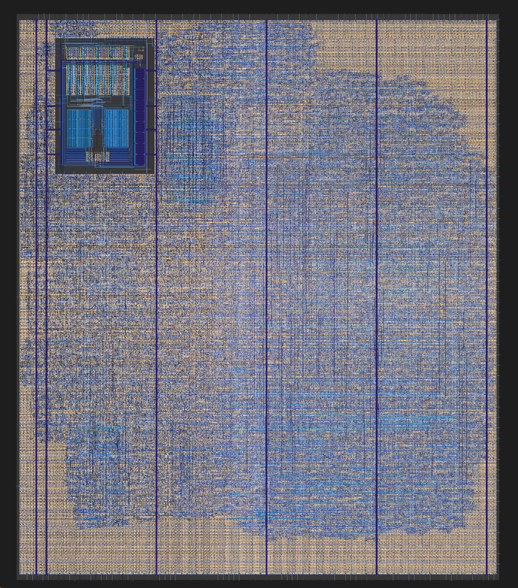
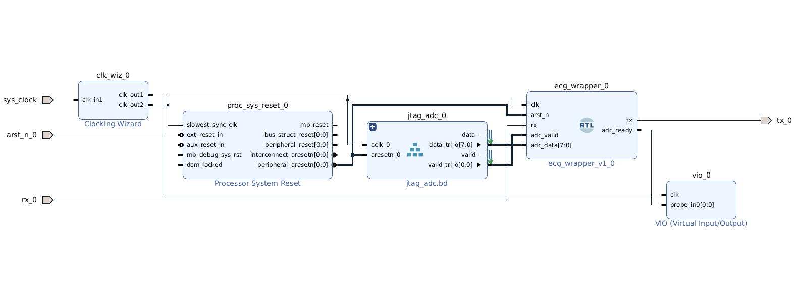
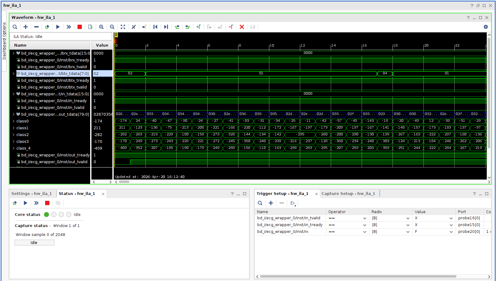
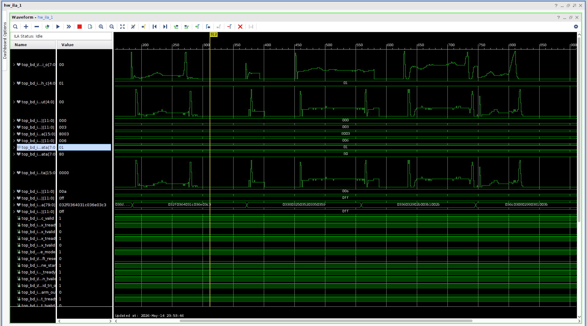
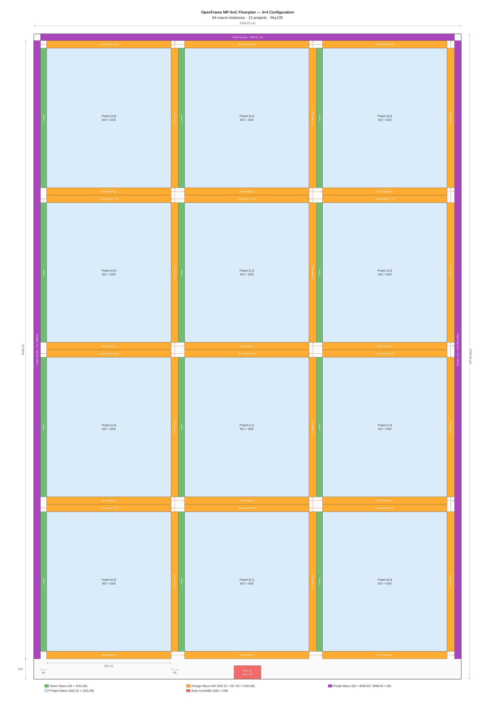
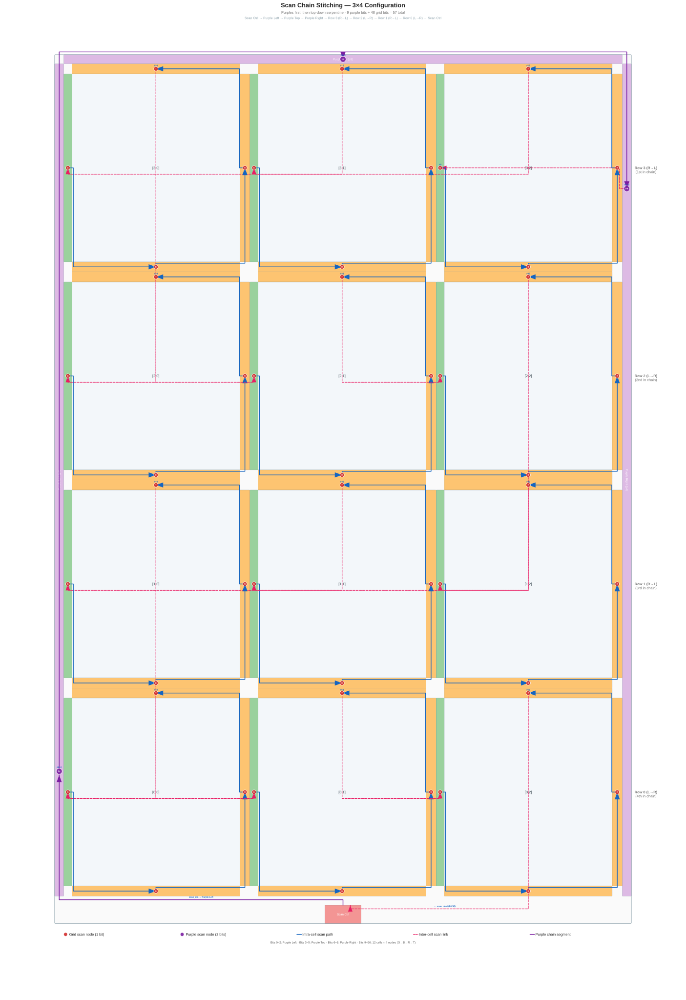

# Q-PULSE — TinyECG Arrhythmia Classifier on Silicon with an ADC analog front end for live ECG signal processing  

[](https://opensource.org/licenses/Apache-2.0)

Q-PULSE is a full-stack **analog/mixed-signal ECG arrhythmia classifier** that travels from a trained neural network all the way to a physical chip. A lightweight **1D CNN (TinyECG)** classifies 187-sample ECG windows into 5 arrhythmia classes, is compiled to fixed-point RTL using **hls4ml / Vitis HLS**, and wrapped with a UART interface. The analog front-end is provided by the [**Wulffern TT06 8-bit SAR ADC**](https://github.com/wulffern/tt06-sar) (`tt_um_TT06_SAR_wulffern`) — a Successive Approximation Register ADC implemented in Sky130 analog primitives — which digitises the raw ECG signal before it enters the inference pipeline. The complete design is verified with **cocotb + pyUVM** (RTL simulation) and a **pyuvm Hardware-In-the-Loop** environment that drives both the UART and ADC/JTAG stimulus paths against a real FPGA. The digital core is hardened in **LibreLane** for the **Sky130** process and taped out alongside the SAR ADC as one project slot in an **eFabless OpenFrame Multi-Project Chip** (Silicon Sprint 26).


---

## Table of Contents

- [Q-PULSE — TinyECG Arrhythmia Classifier on Silicon with an ADC analog front end for live ECG signal processing](#q-pulse--tinyecg-arrhythmia-classifier-on-silicon-with-an-adc-analog-front-end-for-live-ecg-signal-processing)
  - [](#)
  - [Table of Contents](#table-of-contents)
  - [Project Overview](#project-overview)
  - [Repository Structure](#repository-structure)
  - [Component Deep-Dives](#component-deep-dives)
    - [1. ML Model Training](#1-ml-model-training)
      - [TinyECG Architecture](#tinyecg-architecture)
    - [2. HLS Conversion (hls4ml + Vitis HLS)](#2-hls-conversion-hls4ml--vitis-hls)
      - [Quantisation \& Precision](#quantisation--precision)
      - [HLS Configuration Summary](#hls-configuration-summary)
      - [Makefile Flow](#makefile-flow)
      - [FIFO Depth Tuning](#fifo-depth-tuning)
    - [3. HLS Synthesis Results](#3-hls-synthesis-results)
      - [Performance](#performance)
      - [AXI-Stream Interfaces](#axi-stream-interfaces)
    - [4. RTL Sources](#4-rtl-sources)
      - [HLS-Generated Modules (`tiny_ecg_no_activ_*`)](#hls-generated-modules-tiny_ecg_no_activ_)
      - [Integration RTL](#integration-rtl)
    - [5. Verification](#5-verification)
      - [DUT](#dut)
      - [Architecture](#architecture)
      - [UART Packet Protocol](#uart-packet-protocol)
    - [6. FPGA Validation (HIL)](#6-fpga-validation-hil)
      - [UART Path](#uart-path)
      - [ADC Path (JTAG)](#adc-path-jtag)
      - [Test Suite](#test-suite)
      - [Makefile Quick-Reference](#makefile-quick-reference)
    - [7. Mixed-Signal Cosimulation (SAR ADC)](#7-mixed-signal-cosimulation-sar-adc)
      - [Testbench (`tb_sar_cosim.v`)](#testbench-tb_sar_cosimv)
      - [SPICE Wrapper (`tt06_sar_cosim.cir`)](#spice-wrapper-tt06_sar_cosimcir)
      - [Running the Cosim](#running-the-cosim)
      - [VPI Shell (`tt_um_TT06_SAR_wulffern.v`)](#vpi-shell-tt_um_tt06_sar_wulffernv)
    - [8. Place \& Route — LibreLane](#8-place--route--librelane)
      - [Design Parameters](#design-parameters)
      - [Config Stage Pipeline](#config-stage-pipeline)
      - [PnR Results — `final` run](#pnr-results--final-run)
      - [Timing Summary (post-PnR STA)](#timing-summary-post-pnr-sta)
    - [9. OpenFrame Multi-Project Wrapper](#9-openframe-multi-project-wrapper)
      - [Grid Architecture](#grid-architecture)
    - [10. MATLAB Preprocessing Simulation](#10-matlab-preprocessing-simulation)
  - [Tools \& Dependencies](#tools--dependencies)
  - [Quickstart](#quickstart)
    - [1. Train the Model](#1-train-the-model)
    - [2. Convert Keras → HLS](#2-convert-keras--hls)
    - [3. Compare Accuracy](#3-compare-accuracy)
    - [4. Generate ECG Test Vectors (MATLAB)](#4-generate-ecg-test-vectors-matlab)
    - [5. Run RTL Verification](#5-run-rtl-verification)
    - [6. FPGA Hardware-In-the-Loop](#6-fpga-hardware-in-the-loop)
    - [7. Physical Implementation](#7-physical-implementation)
  - [Dataset](#dataset)

---

## Project Overview

```
  Analog ECG signal         MIT-BIH CSV ──► Keras Training ──► .h5 model
         │                                                           │
         ▼                                                      hls4ml convert
  ┌─────────────────────┐                                            │
  │     SAR ADC         │                                  Vitis HLS synthesis
  │  tt_um_TT06_SAR     │                                            │
  │  (Sky130 analog)    │                             Verilog RTL + weights
  └──────┬──────────────┘                                            │
         │ 8-bit digital samples                                     │
         └────────────────────────────┬──────────────────────────────┘
                                      │
                    ┌─────────────────┴──────────────────────┐
                    │           ecg_wrapper (top)            │
                    │  ADC / UART ──► TinyECG core ──► UART  │
                    └─────────────────┬──────────────────────┘
                            cocotb / pyUVM  ·  pyuvm HIL
                          verification (UART + ADC/JTAG paths)
                                      │
                     ┌────────────────┴────────────────────┐
                     │       LibreLane PnR (Sky130)        │
                     │  SAR ADC macro + TinyECG dig. core  │
                     └────────────────┬────────────────────┘
                          project_macro (880 × 1032 µm)
                                      │
                        eFabless OpenFrame MP-SoC slot
```

---

## Repository Structure

```
si-sprint26-project-q-pulse/
├── src/                          # Final RTL sources for tape-out
│   ├── verilog/                  # Synthesised Verilog + integration RTL
│   │   ├── tiny_ecg_no_activ*.v  # HLS-generated inference engine
│   │   ├── ecg_wrapper.v         # Top-level: ECG core + UART bridge
│   │   ├── axis_uart_tx_bridge.v # AXI-Stream → UART TX
│   │   ├── uart_rx.v             # UART receiver
│   │   ├── uart_rx_axis_bridge.v # UART RX → AXI-Stream CSR packets
│   │   ├── uart_tx.v             # UART transmitter
│   │   ├── FixedCompare.v        # Fixed-point comparison utility
│   │   └── *.dat                 # ROM initialisation files (weights)
│   └── report/
│       └── csynth.rpt            # Vitis HLS synthesis report
│
├── verf/                         # Hardware verification
│   ├── ecg_uvm/                  # pyUVM (cocotb) verification environment
│   │   ├── cfg.py                # Environment configuration dataclass
│   │   ├── protocol.py           # UART packet protocol model
│   │   ├── data_loader.py        # Test-vector loader
│   │   ├── runtime.py            # Simulation runtime helpers
│   │   ├── uart_rx_uvc/          # Active UART-RX agent
│   │   ├── uart_tx_uvc/          # Passive UART-TX monitor
│   │   ├── env/                  # Scoreboard + environment
│   │   ├── tests/                # Test classes (Smoke, MiniRegression)
│   │   └── tv/                   # Reference test vectors
│   ├── pyuvm_ecg/                # Alternate pyUVM test suite
│   ├── uart_tx_uvc/              # UVC for UART TX (SystemVerilog)
│   └── Makefile                  # cocotb sim entry point
│
├── pnr/                          # Physical implementation
│   ├── project_macro/            # LibreLane config for the ECG macro
│   │   ├── config.json           # Locked LibreLane config (merged)
│   │   ├── config_stages/        # Staged JSON configs (syn→signoff+eco)
│   │   ├── pin_order.cfg         # I/O pin assignment
│   │   ├── pnr.sdc / signoff.sdc # Timing constraints
│   │   ├── merge_configs.py      # Config stage merger
│   │   ├── fixed_dont_change/    # Pre-placed DEF templates
│   │   ├── drc_report.rpt        # DRC results
│   │   └── runs/                 # LibreLane run outputs
│   ├── Makefile                  # LibreLane / Caravel flow entry point
│   ├── Caravel_OF_MPC.md         # Full OpenFrame architecture spec
│   └── README.md                 # Multi-project chip documentation
│
├── hls4ml/                       # HLS conversion — tape-out run
│   ├── Makefile
│   └── tiny_ecg_clip_reluf3s_run1/   ← tape-out HLS project
│       └── hls4ml_config.yml
├── fpga/                         # FPGA validation
│   ├── testing/                  # Hardware-in-the-loop (HIL) test suites
│   │   ├── adc_uvm/              # pyuvm HIL environment — UART + ADC/JTAG paths (no cocotb)
│   │   │   ├── cfg.py            # ECGEnvConfig (UART + ADC fields)
│   │   │   ├── transport.py      # UART serial_asyncio transport
│   │   │   ├── env/              # ECGEnv, scoreboard, coverage
│   │   │   ├── tests/            # test_lib.py — all UART + ADC test classes
│   │   │   ├── adc_uvc/          # ADC agent: driver + sequencer + seq lib
│   │   │   │   ├── adc_agent.py
│   │   │   │   ├── adc_jtag_transport.py   # xsdb subprocess wrapper
│   │   │   │   ├── adc_seq_lib.py          # class-stratified sequences
│   │   │   │   └── adc_virtual_seq_lib.py
│   │   │   ├── uart_rx_uvc/      # UART RX monitor
│   │   │   ├── uart_tx_uvc/      # UART TX driver + CSR sequences
│   │   │   ├── run_adc.py        # CLI entry point (all tests)
│   │   │   └── Makefile
│   ├── bitstreams/               # Pre-built FPGA bitstreams
│   ├── vivado/                   # Vivado project files
│   └── Makefile
├── cosim/                        # Mixed-signal cosimulation — SAR ADC transistor-level
│   ├── Makefile                      # spicebind VPI build + run targets
│   ├── tb_sar_cosim.v                # Sine-sweep Verilog testbench (20 kHz, 4 cycles)
│   ├── tt_um_TT06_SAR_wulffern.v    # spicebind VPI shell (Verilog↔SPICE port mapping)
│   └── tt06_sar_cosim.cir           # SPICE wrapper (.include post-layout LPE netlist)
├── tt06-sar/                     # Wulffern TT06 SAR ADC (git submodule → github.com/wulffern/tt06-sar)
├── matlab/                       # MATLAB ECG beat-detection & CNN input vector generation
│   ├── ecg_algo.m                # Peak-pair detector + preprocessing simulation
│   ├── mitbih_test.csv           # MIT-BIH test-set beat rows (187 samples, 8-bit ADC)
│   └── nstdb/                    # NSTDB noise CSVs (bw / ma / em)
├── model/                        # Exported model files (JSON + H5)
└── scripts/                      # Utility scripts
    ├── change_fifo_depth.py      # Patch HLS FIFO depths in generated project
    ├── compare_sim.py            # Keras float32 vs HLS fixed-point comparison
    ├── convert_hls_onnx.py       # Rebuild model + export to HLS & ONNX
    ├── export_model_json.py      # Export model architecture as JSON
    ├── fifo_depth_search.py      # Binary search for minimum FIFO depth
    ├── generate_tb_data.py       # Generate HLS testbench input/output vectors
    ├── parallel_cosim.py         # Run co-simulations in parallel
    ├── run_hls_conversion.py     # Drive the full HLS conversion flow
    └── validate_cosim.py         # Validate co-simulation outputs
```

---

## Component Deep-Dives

### 1. ML Model Training

**Script**: `ECG/Newstart/model_training.py`  
**Dataset**: MIT-BIH Arrhythmia Database (CSV, 187 features + 1 label column)

#### TinyECG Architecture

| Layer | Type | Filters/Units | Kernel | Activation |
|-------|------|--------------|--------|------------|
| input | Input | — | — | — |
| conv1 | Conv1D | 4 | 3 | ReLU |
| pool1 | MaxPool1D | — | 2 | — |
| conv2 | Conv1D | 8 | 3 | ReLU |
| pool2 | MaxPool1D | — | 2 | — |
| flatten | Flatten | — | — | — |
| dense | Dense | 5 | — | (argmax in HW) |

**Input shape**: `(187, 1)` — one normalised scalar per timestep  
**Output**: 5-class logit vector; argmax taken in hardware wrapper  
**5 classes**: Normal (N), Supraventricular (S), Ventricular (V), Fusion (F), Unknown (Q)

---

### 2. HLS Conversion (hls4ml + Vitis HLS)

**Config**: `hls4ml/tiny_ecg_clip_reluf3s_run1/hls4ml_config.yml`

#### Quantisation & Precision

```yaml
Precision: ap_fixed<10,5>   # 10-bit, 5 integer bits — all layers
```

All weights, biases, and intermediate results use 10-bit fixed-point arithmetic (`ap_fixed<10,5>` = 5 fractional bits).

#### HLS Configuration Summary

| Parameter | Value |
|-----------|-------|
| Backend | Vitis HLS |
| IO type | `io_stream` (AXI-Stream) |
| Strategy | `Resource` (LUT-optimised) |
| BRAM avoidance | `BramFactor = 1e12` (weights in LUT-RAM) |
| Clock period | 50 ns (20 MHz) |
| Target part | `xcku115-flvb2104-2-e` (Kintex UltraScale+) |
| Conv1 `ReuseFactor` | 20 |
| Conv2 `ReuseFactor` | 160 |
| Dense `ReuseFactor` | 1720 |

#### Makefile Flow

```bash
# From hls4ml/ directory
make convert   # Keras → HLS project (tiny_ecg_clip_reluf3s_run1)
make tbdata    # Generate test-bench data
make csim      # C simulation
make synth     # RTL synthesis
make cosim     # Co-simulation
make compare   # Accuracy comparison vs float32
```

#### FIFO Depth Tuning

HLS dataflow pipelines require inter-layer FIFOs. These are tuned for RTL co-simulation:

```bash
cd hls4ml
make change_depth DEPTH=4096
make change_depth DRY_RUN=1 DEPTH=4096  # preview only
```

---

### 3. HLS Synthesis Results

**Report**: `src/report/csynth.rpt` — Vivado 2023.1, solution `tiny_ecg_no_activ`

#### Performance

| Metric | Value |
|--------|-------|
| Total latency | 4,647 cycles |
| Latency (50 ns clock) | ~232 ms |
| Initiation interval | 4,642 cycles |
| Architecture | Dataflow |


#### AXI-Stream Interfaces

| Interface | Direction | TDATA width |
|-----------|-----------|-------------|
| `input_layer_3` | Input | 16 bits (1 sample × 8-bit + framing) |
| `layer11_out` | Output | 80 bits (5 classes × 8-bit + framing) |

---

### 4. RTL Sources

**Directory**: `src/verilog/`

#### HLS-Generated Modules (`tiny_ecg_no_activ_*`)

| Module | Description |
|--------|-------------|
| `tiny_ecg_no_activ.v` | Top-level HLS dataflow wrapper |
| `*conv_1d_cl*config2*.v` | Conv1D block 1 (4 filters, ReuseFactor=20) |
| `*conv_1d_cl*config6*.v` | Conv1D block 2 (8 filters, ReuseFactor=80) |
| `*relu*config4*.v` | ReLU activation after Conv1 |
| `*relu*config8*.v` | ReLU activation after Conv2 |
| `*pooling1d_cl*config5*.v` | MaxPool after Conv1 |
| `*pooling1d_cl*config9*.v` | MaxPool after Conv2 |
| `*dense*config11*.v` | Fully-connected output layer (5 classes) |
| `*fifo_w20_d*`, `*fifo_w40_d*` | Inter-layer dataflow FIFOs |
| `*mul_*`, `*mux_*` | Arithmetic and MUX primitives |
| `*.dat` | ROM weight initialisation data |

#### Integration RTL

| File | Description |
|------|-------------|
| `ecg_wrapper.v` | Top-level: binds ECG core to UART bridge |
| `uart_rx.v` | UART receiver (configurable baud divisor) |
| `uart_rx_axis_bridge.v` | UART RX → AXI-Stream CSR packet decoder |
| `axis_uart_tx_bridge.v` | AXI-Stream output → UART TX byte stream |
| `uart_tx.v` | UART transmitter |

---

### 5. Verification

**Directory**: `fpga/testing/adc_uvm/`  
**Framework**: pyuvm — runs under `asyncio.run()` (no cocotb)  
**Simulators**: targets real FPGA hardware via SerialTransport + AdcJtagTransport

#### DUT

`ecg_wrapper` on FPGA — exercised via UART CSR/sample packets (UART path) or AXI-Lite ADC injection (ADC/JTAG path).

#### Architecture

```
  FTDI USB-UART ──► UARTTxAgent
                    └─ UARTTxDriver ──(16-bit CSR/sample pkts)──────────► DUT RX
                       tx_item_ap ─────────────────────────────────────────────┐
                                                                               │
  JTAG (xsdb) ────► ADCAgent                                                   │
                    ├─ ADCDriver ────(AXI-Lite mwr sample + valid)──────► DUT adc_*
                    │  adc_item_ap ────────────────────────────────────────────│
                    └─ ADCSequencer                                            │
                       metadata_ap ────────────────────────────────────────────┤
                                                                               ▼
                                                                         ECGPredictor
                                                                                │
                                                                    (filtered metadata)
                                                                                │
                                                                                ▼
  DUT UART TX ────► UARTRxAgent                                         ECGScoreboard
                    └─ UARTRxMonitor ──(1-byte argmax result)──────────►(ref compare)
                       monitor.ap ─────────────────────────────────────► ECGClassCoverage
```

#### UART Packet Protocol

Each transaction is **2 UART bytes** (byte-0 first / LSB), forming a 16-bit word:

```
  Bit [15]    : CSR Address Space Select  (0 = data write, 1 = CSR write)
  Bit [14:12] : Register Address          (3-bit, selects one of 6 CSRs)
  Bit [11:0]  : Payload                   (CSR data  OR  input sample zero-padded to 12 bits)
```

**Register Map** (bit [15]=1 selects the CSR space; bit [15]=0 sends a data sample):

| Address `[15:12]` | Register | Bits used | Description |
|-------------------|----------|-----------|-------------|
| `0xxx` | Data Register | `[9:0]` | ECG input sample (`ap_fixed<10,5>`, zero-padded) |
| `1000` | **CSR** — Control | `[2]` soft_rst · `[1]` ap_start · `[0]` mode | Soft reset, start inference, ADC/UART mode select |
| `1001` | Slope Threshold | `[DATA_W-1:0]` | R-peak slope detector threshold |
| `1010` | RS Window | `[DATA_W-1:0]` | R-S interval window |
| `1011` | Max Window | `[DATA_W-1:0]` | Maximum detection window |
| `1100` | Tolerance | `[DATA_W-1:0]` | Peak detection tolerance |
| `1101` | Floor Offset | `[DATA_W-1:0]` | Baseline floor offset |

**TX response** (1 UART byte):

```
  Bit [4:0] : one-hot argmax class  (class 0–4 from dense layer output)
```

The reference outputs are taken directly from the hls4ml C-simulation artifacts (`csim_results.log`), providing a golden reference without re-implementing the inference model.

---

### 6. FPGA Validation (HIL)

**Directory**: `fpga/testing/adc_uvm/`  
**Framework**: pyuvm — runs under `asyncio.run()` against real hardware (no cocotb required)  
**Connection**: FTDI USB-UART bridge → `/dev/ttyUSBx` (UART path) + Vivado `xsdb` over JTAG (ADC path)  
**Physical ADC**: [Carsten Wulffern — TT06 8-bit SAR ADC](https://github.com/wulffern/tt06-sar) (`tt_um_TT06_SAR_wulffern`)

`adc_uvm` is the single HIL verification environment for all test paths. It replaces the earlier `ecg_uvm` HIL suite and supports both stimulus paths out of the same codebase.

Two independent stimulus paths exercise the deployed FPGA bitstream:

#### UART Path

Test vectors are streamed as 2-byte packets over the FTDI UART bridge. The `UARTTxDriver` injects 13-bit CSR/sample packets; the `UARTRxMonitor` captures inference result bytes.

```
Host ──USB──► FTDI ──UART──► FPGA RX  (sample packets + CSR writes)
                              FPGA TX ──UART──► FTDI ──USB──► Host (inference bytes)
```



#### ADC Path (JTAG)

Samples bypass the UART ingestion datapath and are injected directly into the HLS inference core via AXI-Lite MMIO using Vivado `xsdb`. This path models the interface of the [Wulffern TT06 SAR ADC](https://github.com/wulffern/tt06-sar) — the 8-bit SAR ADC that feeds the ECG classifier on the physical chip. Running this path validates the inference core in isolation from UART protocol overhead.




| Aspect | UART path | ADC path |
|--------|-----------|----------|
| Stimulus delivery | `UARTTxDriver` over serial | `ADCDriver` via `xsdb mwr` |
| DUT interface | UART RX | AXI-Lite (ADC sample + valid regs) |
| Response capture | `UARTRxMonitor` | `UARTRxMonitor` (same) |
| Entry point | `run_hil.py` | `run_adc.py` |

**Key ADC configuration** (`adc_uvm/cfg.py`):

| Field | Default | Description |
|-------|---------|-------------|
| `xsdb_path` | `"xsdb"` | Path to Vivado `xsdb` executable |
| `adc_sample_addr` | `0x40000000` | AXI-Lite address of ADC sample register |
| `adc_valid_addr` | `0x40010000` | AXI-Lite address of ADC valid register |
| `adc_sample_period_s` | `1/125` (8 ms) | Inter-sample delay (125 Hz ECG rate) |
| `dc_offset` | `70` | Integer DC bias added to every scaled sample |
| `ac_gain` | `2.0` | Multiplicative gain applied before injection |

#### Test Suite

All ADC tests extend `ECGBaseAdcTest`. The virtual sequence (`ECGAdcVirtualSequence`) always: soft-resets the HLS core → flushes RX → writes threshold CSRs → sets `mode=ADC, ap_start=1` → runs the factory-overridable stimulus sequence.

| Test | Stimulus | Description |
|------|----------|-------------|
| `ECGAdcSmokeTest` | `ADCNormalSequence` | Single-epoch smoke test |
| `ECGAdcNormalTenTest` | `ADCNormalSequence` | N normal epochs |
| `ECGAdcSupraventricularTest` | `ADCSupraventricularSequence` | S-class epochs |
| `ECGAdcVentricularTest` | `ADCVentricularSequence` | V-class epochs |
| `ECGAdcFusionTest` | `ADCFusionSequence` | F-class epochs |
| `ECGAdcUnknownTest` | `ADCUnknownSequence` | Q-class epochs |
| `ECGAdcNineNormalOneBadTest` | `ADCNineNormalOneBadSequence` | 9 normal + 1 bad per batch |
| `ECGAdcRepeatEpochTest` | `ADCRepeatEpochSequence` | Same epoch repeated (deterministic replay) |

UART-path tests (`ECGBaseTest` subclasses: `ECGSmokeTest`, `ECGMiniRegressionTest`, `ECGFullDatasetTest`, `ECGSoftResetTest`, etc.) share the same `ECGEnv` and are run via `run_adc.py`.

#### Makefile Quick-Reference

```bash
cd fpga/testing/adc_uvm

# ADC/JTAG path
make adc-smoke                                  # ECGAdcSmokeTest (1 epoch)
make test TEST=ECGAdcVentricularTest NUM_FRAMES=20
make test TEST=ECGAdcRepeatEpochTest NUM_FRAMES=10 PORT=/dev/ttyUSB2

# UART path (same entry point)
make smoke                                      # ECGSmokeTest
make regression                                 # ECGMiniRegressionTest (8 epochs)
make full                                       # ECGFullDatasetTest (50 epochs)
make soft-reset

# Direct invocation
python run_adc.py --test ECGAdcSmokeTest
python run_adc.py --test ECGSmokeTest --port /dev/ttyUSB2 --baud 115200
```

Overridable variables: `PORT` (default `/dev/ttyUSB2`), `BAUD`, `TIMEOUT`, `BYTE_TIMEOUT`, `VERBOSITY`, `NUM_FRAMES`.

---

### 7. Mixed-Signal Cosimulation (SAR ADC)

**Directory**: `cosim/`  
**Tool chain**: [spicebind](https://github.com/wulffern/spicebind) VPI + Icarus Verilog (iverilog) + ngspice 43  
**ADC source**: `tt06-sar/` git submodule — [Wulffern TT06 8-bit SAR ADC](https://github.com/wulffern/tt06-sar)

The cosim validates the SAR ADC at **transistor level** by coupling a Verilog testbench to the post-layout extracted SPICE netlist (`spi/tt_um_TT06_SAR_wulffern_lpe.spi`) via the spicebind VPI. Digital stimulus and control signals are driven from Verilog; every SPICE time-step the VPI bridges the real-valued analog nodes (`ua_1`, `ua_0`) into the ngspice shared-library solver.

#### Testbench (`tb_sar_cosim.v`)

Drives a **20 kHz differential sine sweep** (4 full cycles = 200 µs) at the SAR ADC inputs:

| Parameter | Value |
|-----------|-------|
| Clock | 4 MHz (250 ns period, matches chip clock) |
| Vcm | 0.9 V (VCC/2, cancels differentially) |
| Half-amplitude | 0.36 V → V_diff_pk = 0.72 V ≈ 102 LSB peak |
| Phase offset | π/4 → first sample at V_diff ≈ 0.51 V |
| Input update rate | every 50 ns (independent of clock edge to avoid delta-cycle race in VPI) |
| Output encoding | Offset binary — subtract 128 for signed two's complement |

On each `DONE` pulse (`uio_out[0]`) the testbench prints:
```
[<time> ns] DONE  raw=<0–255>  signed=<−128..+127>  sampled_diff=<V>
```

#### SPICE Wrapper (`tt06_sar_cosim.cir`)

```
.lib  <PDK>/sky130A/libs.tech/ngspice/sky130.lib.spice  tt   ← typical corner
.include ../spi/tt_um_TT06_SAR_wulffern_lpe.spi              ← post-layout LPE
.option TEMP=27  RELTOL=0.03  METHOD=Gear  TRTOL=7
Vpwr  VPWR 0  DC 1.8
```

#### Running the Cosim

**Prerequisites**: spicebind installed (`pip install -e /path/to/spicebind`), ngspice 43 shared library at `~/.local/lib/libngspice.so`, iverilog.

```bash
cd cosim
make run          # build + run (VCD output: tb_sar_cosim.vcd)
make run_debug    # same, with spicebind_vpi_debug (verbose SPICE↔Verilog bridge)
make clean
```

#### VPI Shell (`tt_um_TT06_SAR_wulffern.v`)

A thin Verilog module that declares `real` ports (`ua_1`, `ua_0`) and the standard Tiny Tapeout digital pins. spicebind injects the analog values into ngspice and reads back `uo_out[7:0]` (conversion result) and `uio_out[0]` (DONE flag) via `ngGet_Vec_Info`.

---

### 8. Place & Route — LibreLane

**Directory**: `pnr/project_macro/`  
**Tool**: LibreLane 2 (CIEL release)  
**PDK**: Sky130A (`sky130_fd_sc_hd`)

#### Design Parameters

| Parameter | Value |
|-----------|-------|
| Design name | `project_macro` |
| Die area | 880 × 1031.66 µm |
| Clock port | `clk` |
| Clock period | 250 ns (4 MHz, `sky130_fd_sc_hd`) |
| Max metal layer | `met4` |
| Power VDD/GND | `vccd1` / `vssd1` |
| Max fanout | 17 |
| Antenna repair | Enabled (diode-on-ports) |

#### Config Stage Pipeline

The final `config.json` is assembled by merging staged configs:

```
config_stages/
  all.json          ← global settings (applies to all stages)
  1_syn.json        ← synthesis overrides
  2_floorplan.json  ← floorplan / die area
  3_powerplan.json  ← PDN configuration
  4_placement.json  ← placement / resizer margins
  5_cts.json        ← clock tree synthesis
  6_routing.json    ← routing layer rules
  7_signoff.json    ← final timing / DRC checks
  eco.json          ← engineering change order patches
```

Regenerate after editing any stage:

```bash
cd pnr/project_macro
make config        # merge, write, and lock config.json
```

#### PnR Results — `final` run

| Metric | Value |
|--------|-------|
| Die area | 880 × 1031.66 µm (907,861 µm²) |
| Core area | 868.94 × 1009.12 µm (876,865 µm²) |
| Core utilisation | 47.8 % |
| Standard cells | 44,960 |
| Sequential cells (FFs) | 5,379 |
| Total instances (incl. fill) | 175,353 |
| Routed nets | 32,237 |
| Total wire length | 1,002,857 µm |
| Vias | 215,480 |
| Antenna violations | 0 |
| Antenna diodes inserted | 405 
| LVS errors | 0 |
| DRC errors (final) | 0 |
| Total power (nom_tt_025C_1v80) | 4.61 mW |
| — Internal | 3.47 mW |
| — Switching | 1.14 mW |
| — Leakage | ~950 nW |

#### Timing Summary (post-PnR STA)

| Corner | Setup WS (ns) | Hold WS (ns) | Setup Viol. | Hold Viol. |
|--------|--------------|-------------|-------------|------------|
| nom_tt_025C_1v80 | 41.54 | 0.725 | 0 | 0 |
| nom_ss_100C_1v60 | 37.58 | 1.170 | 0 | 0 |
| nom_ff_n40C_1v95 | 42.98 | 0.438 | 0 | 0 |
| **Worst overall** | **37.41** | **0.430** | **0** | **0** |

All corners meet timing with positive slack. No setup or hold violations.

---

### 9. OpenFrame Multi-Project Wrapper

**Spec**: `pnr/Caravel_OF_MPC.md`  
**Platform**: eFabless OpenFrame (44 Caravel GPIOs, 3 chip edges)

#### Grid Architecture

```
                        ┌──────────────────┐
                        │   Top Orange     │ ── R→L ──► Left Purple ──► gpio[37:24]
                        └──────────────────┘
   ┌──────────┐         ┌──────────────────┐         ┌──────────────────┐
   │  Green   │──clk──► │                  │ ───────►│  Right Orange    │
   │ (gate /  │──rst──► │  PROJECT MACRO   │         │                  │ ── B→T ──► Top Purple ──► gpio[23:15]
   │  reset)  │──por──► │  (user design)   │         │                  │
   └──────────┘         └──────────────────┘         └──────────────────┘
                        ┌──────────────────┐
                        │  Bottom Orange   │ ── L→R ──► Right Purple ──► gpio[14:0]
                        └──────────────────┘
```



Each project slot (one Q-PULSE ECG core among up to 20) contains:
- **Green macro**: per-project clock gating (ICG) + reset isolation
- **3× Orange macros**: 15-wide GPIO MUX (bottom, right, top)
- **Purple macros** (chip edge): aggregate row/column outputs to pads
- **Scan macro node**: dual-sided scan port with shadow-latch configuration register



---

### 10. MATLAB Preprocessing Simulation

**Directory**: `matlab/`  
**Script**: `ecg_algo.m`  
**Purpose**: Software-faithful model of the ASIC beat-detection and preprocessing pipeline; primary source of CNN input vectors for UVM testbenches.

The script loads a single beat row from `mitbih_test.csv`, tiles it into a continuous 8-bit ADC stream at 125 Hz, optionally injects SNR-calibrated NSTDB noise, and runs the same peak-pair detection state machine that is implemented in hardware. Each accepted beat window is floor-subtracted and right-shifted to produce 5-bit samples (0–31), then written to transaction files consumed by the `verf/` and `fpga/testing/` testbenches.

#### Beat-Detection State Machine

| Stage | Description |
|---|---|
| Slope trigger | Rising edge ≥ `slope_thresh_knob` ADC/sample latches Peak 1 |
| Rolling min | Tracks deepest post-peak sample; reset guard if drop > `rs_window_knob` |
| Rolling max | Tracks highest post-peak sample; hump guard via `max_window_knob` |
| Tolerance gate | Peak 2 accepted only if magnitude error ≤ `tolerance` (fractional) |
| Preprocessing | Floor-subtract `rolling_min`, right-shift `output_shift` → 5-bit output |

#### Key Parameters

| Parameter | Default | Description |
|---|---|---|
| `slope_thresh_knob` | 15 | Minimum dy/sample to fire slope trigger |
| `rs_window_knob` | 255 | Max Peak-1-to-rolling-min drop before reset |
| `max_window_knob` | -100 | Hump detector threshold (Peak-1 minus rolling-max) |
| `tolerance` | 1 | Max fractional magnitude mismatch between Peak 1 and Peak 2 |
| `refractory_delay` | 10 | Samples to skip after any peak/reset event |
| `output_shift` | 2 | Right-shift applied to floor-subtracted window (5-bit range) |
| `noise_profile` | `'mixed'` | `'none'` / `'bw'` / `'ma'` / `'em'` / `'mixed'` |
| `target_snr_db` | 10 | Injection SNR for NSTDB noise |

#### Output Files

| File | Content |
|---|---|
| `input_vectors.txt` | Preprocessed CNN inputs (floor-subtracted, bit-shifted) |
| `input_vectors_raw_unscaled.txt` | Raw ADC values of the accepted window |
| `input_vectors_raw_scaled.txt` | Reference beat normalised to 0–31 |
| `all_preprocessed_samples.mat/.csv` | Concatenated accepted windows for offline analysis |

All files use the `[[[runtime]]]` / `[[transaction]] N` / `[[/transaction]]` format expected by the UVM environments in `verf/` and `fpga/testing/`.

See [`matlab/README.md`](matlab/README.md) for the full parameter reference.

---

## Tools & Dependencies

| Tool / Library | Version | Purpose |
|----------------|---------|---------|
| TensorFlow / Keras | 2.x | ECG model training |
| hls4ml | latest | Keras → HLS transpilation |
| Vitis HLS | 2023.1 | C/RTL synthesis and co-simulation |
| Vivado | 2023.1 | FPGA bitstream + `xsdb` JTAG transport |
| LibreLane 2 (CIEL) | CC2509 tag | Physical PnR flow (run via `nix-shell`) |
| Sky130A PDK | open_pdks `3e0e31d` | Fabrication process |
| eFabless OpenFrame | CC2509 | Multi-project chip platform |
| cocotb | latest | Python-based RTL simulation |
| pyUVM | latest | Python UVM verification framework |
| serial_asyncio / pyserial | latest | UART transport for HIL tests |
| Icarus Verilog | latest | RTL simulation (default) |
| Verilator | 5.x | RTL simulation (alternate) |
| Python | ≥3.8 | All scripts |
| pandas / numpy / scikit-learn | latest | Data processing |

---

## Quickstart

### 1. Train the Model

```bash
# Training was done using the MIT-BIH dataset (mitbih_train.csv / mitbih_test.csv)
# The tape-out model is pre-trained: model/tiny_ecg_clip_relu_f3s/
```

### 2. Convert Keras → HLS

```bash
cd hls4ml
make convert   # Keras → HLS (tiny_ecg_clip_reluf3s_run1)
make tbdata    # Generate test-bench data
make csim      # C simulation
make synth     # RTL synthesis
```

### 3. Compare Accuracy

```bash
cd hls4ml
make compare   # Accuracy comparison vs float32
```

### 4. Generate ECG Test Vectors (MATLAB)

Run `ecg_algo.m` in MATLAB to produce the transaction files consumed by the UVM testbenches. Open MATLAB, set the working directory to `matlab/`, and run:

```matlab
cd matlab
run('ecg_algo.m')
```

This generates `input_vectors.txt`, `input_vectors_raw_unscaled.txt`, and `input_vectors_raw_scaled.txt` in the working directory. Copy or symlink them into the testbench `tv/` directories as needed. See [`matlab/README.md`](matlab/README.md) for noise and parameter knobs.

### 5. Run RTL Verification

```bash
cd verf
pip install -r ecg_uvm/requirements.txt   # or pyuvm_ecg/requirements.txt
make sim TEST=ECGSmokeTest
make sim TEST=ECGMiniRegressionTest
```

### 6. FPGA Hardware-In-the-Loop

Requires a programmed FPGA connected via FTDI USB-UART bridge (and Vivado `xsdb` for the ADC path).

```bash
# Activate the venv
source fpga/.venv/bin/activate

cd fpga/testing/adc_uvm

# UART path — smoke test
make smoke

# ADC/JTAG path — single smoke epoch (Wulffern SAR ADC interface)
# https://github.com/wulffern/tt06-sar
make adc-smoke

# ADC/JTAG path — 10 epochs, ventricular class
make test TEST=ECGAdcVentricularTest NUM_FRAMES=10 PORT=/dev/ttyUSB2
```

### 7. Physical Implementation

LibreLane is invoked inside a **Nix shell**. See [Module 0 — Installation & Environment Setup](https://silicon-sprint-auc.readthedocs.io/en/latest/MODULE0.html) for the full setup guide.

```bash
# 1. One-time setup: clone LibreLane and enter the Nix shell
git clone https://github.com/librelane/librelane/ ~/librelane
nix-shell --pure ~/librelane/shell.nix

# 2. Verify the environment
[nix-shell:~]$ librelane --version

# 3. Regenerate the merged config, then run the flow
[nix-shell:~]$ cd pnr/project_macro
[nix-shell:~]$ make config          # merge config_stages/ → config.json
[nix-shell:~]$ librelane config.json
```
## Dataset
MIT-BIH Arrhythmia Database used for training is available from [PhysioNet](https://physionet.org/content/mitdb/).
