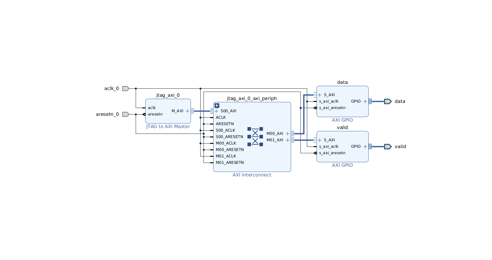

# JTAG ADC Injection — FPGA IP Architecture

## Purpose

This block design (`jtag_adc`) provides a path to inject ADC sample data directly into the FPGA fabric over JTAG, without using the UART sample-ingestion datapath. It is used during HIL verification to feed pre-recorded ECG stimulus straight into the HLS inference core.

---

## Block Design Overview

---

## IP Blocks

### JTAG to AXI Master — `jtag_axi_0`

| Parameter | Value |
|-----------|-------|
| VLNV | `xilinx.com:ip:jtag_axi:1.2` |
| Address space | 4 GB, 32-bit data |
| Interface | `M_AXI` (AXI4-Lite master) |

Bridges the JTAG scan chain to an AXI4-Lite master port. Once connected, the host can issue `mwr` / `mrd` Tcl commands in `xsdb` which translate directly to AXI write/read transactions on `M_AXI`. No processor is involved.

---

### AXI Interconnect — `jtag_axi_0_axi_periph`

| Parameter | Value |
|-----------|-------|
| VLNV | `xilinx.com:ip:axi_interconnect:2.1` |
| `NUM_SI` | 1 (from JTAG AXI master) |
| `NUM_MI` | 2 (to `data` GPIO, `valid` GPIO) |
| Internal crossbar | `axi_crossbar:2.1` with AXI protocol converter |

Routes the single AXI master to the two GPIO slaves based on the address decoded from each transaction.

---

### AXI GPIO — `data`

| Parameter | Value |
|-----------|-------|
| VLNV | `xilinx.com:ip:axi_gpio:2.0` |
| `C_GPIO_WIDTH` | **8** |
| `C_ALL_OUTPUTS` | **1** (output only — no input path) |
| Base address | `0x40000000` |
| Address range | 64 KB (`SEG_data_Reg`) |
| Output port | `data_tri_o[7:0]` → top-level `data[7:0]` |

Holds the current 8-bit ADC sample value. Writing to offset `+0x00` (GPIO Data register) immediately drives the 8 output pins. The FPGA inference logic reads these pins as the ADC data bus.

**AXI GPIO register map (standard Xilinx layout):**

| Offset | Register | Access | Description |
|--------|----------|--------|-------------|
| `0x000` | GPIO_DATA | R/W | Output data register — drives `data_tri_o` |
| `0x004` | GPIO_TRI  | R/W | Tristate — all zeros (outputs); kept at `0x00` since `C_ALL_OUTPUTS=1` |

---

### AXI GPIO — `valid`

| Parameter | Value |
|-----------|-------|
| VLNV | `xilinx.com:ip:axi_gpio:2.0` |
| `C_GPIO_WIDTH` | **1** |
| `C_ALL_OUTPUTS` | **1** |
| Base address | `0x40010000` |
| Address range | 64 KB (`SEG_valid_Reg`) |
| Output port | `valid_tri_o[0]` → top-level `valid` |

Holds the 1-bit ADC valid strobe. Writing `0x1` to `GPIO_DATA` asserts `valid`; writing `0x0` deasserts it. The FPGA FSM samples `data[7:0]` on each clock cycle where `valid=1`.

---

## Address Map

| Segment | Base address | Range | Slave |
|---------|-------------|-------|-------|
| `SEG_data_Reg` | `0x40000000` | 64 KB | `data` AXI GPIO |
| `SEG_valid_Reg` | `0x40010000` | 64 KB | `valid` AXI GPIO |

---

## Signal Interface to the Rest of the Design

The `jtag_adc` block design exposes three ports at its boundary:

| Port | Direction | Width | Description |
|------|-----------|-------|-------------|
| `data` | Output | 8 | ADC sample value, driven by `data` GPIO |
| `valid` | Output | 1 | ADC valid strobe, driven by `valid` GPIO |
| `aclk_0` | Input | 1 | AXI clock (shared with rest of design) |
| `aresetn_0` | Input | 1 | AXI active-low reset |

The top-level block design (`top_bd`) connects `data[7:0]` and `valid` directly to the HLS inference core's ADC input ports.

---

## How to Find the Correct JTAG Target

In `xsdb`, run:

```tcl
connect
targets
```

Example output:
```
  1  APU
     2  A9 #0 (Running)
     3  A9 #1 (Running)
  4  xc7z020 (idcode 23727093 irlen 6 fpga)
     5  ...
  6  PS TAP               ← use this index
```

Select the target that exposes AXI master access to the PL fabric (typically the PS TAP or the FPGA PL entry). Then issue writes:

```tcl
targets 6
mwr 0x40000000 0xA3    ;# write sample value 0xA3 to data register
mwr 0x40010000 0x1     ;# assert valid
mwr 0x40010000 0x0     ;# deassert valid
```
